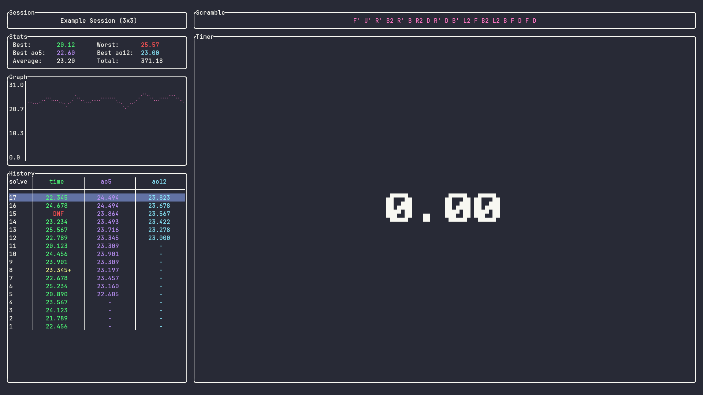

# lazytimer

A terminal-based speedcubing timer written in Rust.



## Features

- Timer with inspection mode
- Support for multiple puzzle types (2x2, 3x3, 4x4, 5x5, Skewb, Pyraminx)
- Session management
- Solve statistics & graph
- Scramble generation
- Data persistence

## Installation

```bash
# Clone the repository
git clone https://github.com/xyzyx4546/lazytimer.git
cd lazytimer

# Install and run the application
cargo install --path .
lazytimer
```

## Keybinds

| Key   | Action                  |
| ----- | ----------------------- |
| ?     | Show keybinds           |
| q     | Quit                    |
| Esc   | Close popup             |
| Enter | Confirm                 |
| Space | Start/stop timer        |
| h / ← | Previous session        |
| j / ↓ | Previous solve          |
| k / ↑ | Next solve              |
| l / → | Next session            |
| g     | Go to first solve       |
| G     | Go to last solve        |
| i     | Show solve details      |
| +     | Toggle +2 penalty       |
| -     | Toggle DNF penalty      |
| d     | Delete selected solve   |
| D     | Delete selected session |
| n     | Create new session      |
