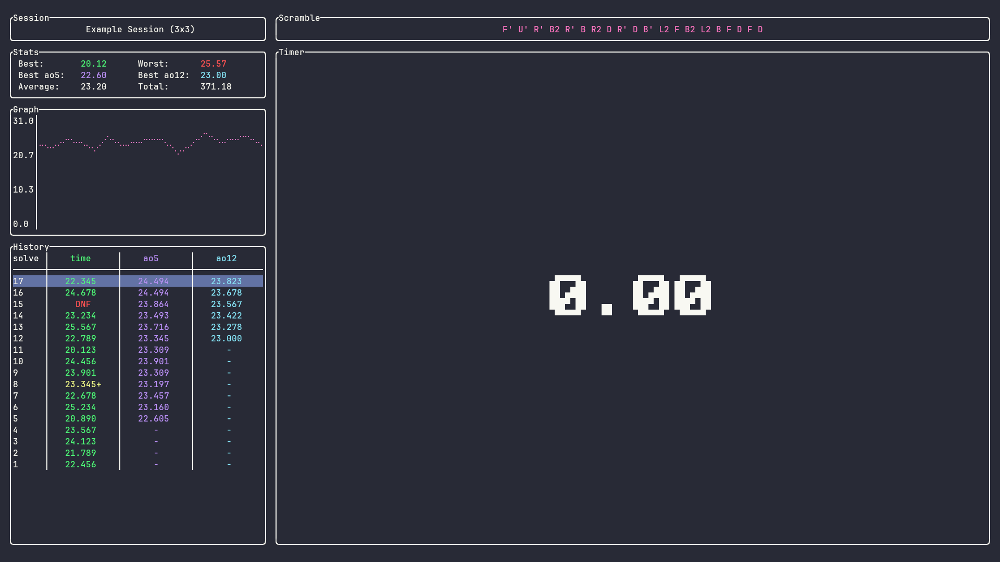

# lazytimer

A terminal-based speedcubing timer written in Rust.



## Features

- Timer with inspection mode
- Support for multiple puzzle types (2x2, 3x3, 4x4, 5x5, Skewb, Pyraminx)
- Solve statistics & graph
- Scramble generation
- Data persistence

## Installation

Make sure your terminal supports [progressive keyboard enhancements](https://sw.kovidgoyal.net/kitty/keyboard-protocol/) (also known as the Kitty keyboard protocol).

You can then install lazytimer using `cargo`

```bash
cargo install lazytimer
```

## Keybinds

| Key   | Action                  |
| ----- | ----------------------- |
| ?     | Show keybinds           |
| q     | Quit                    |
| Esc   | Close popup             |
| Enter | Confirm                 |
| Space | Start/stop timer        |
| h / ← | Previous puzzle type    |
| j / ↓ | Previous solve          |
| k / ↑ | Next solve              |
| l / → | Next puzzle type        |
| g     | Go to first solve       |
| G     | Go to last solve        |
| i     | Show solve details      |
| +     | Toggle +2 penalty       |
| -     | Toggle DNF penalty      |
| d     | Delete selected solve   |

## Configuration

The configuration file is located at `$XDG_CONFIG_HOME/lazytimer/config.toml` or `$HOME/.config/lazytimer/config.toml`.

You can customize the following options:

```toml
[general]
# Directory where solve data is stored
data_dir = "$XDG_DATA_HOME/lazytimer"
# Default puzzle type to show on startup (e.g., "ThreeByThree", "TwoByTwo", etc.)
default_puzzle = "ThreeByThree"

[timer]
# Inspection time in seconds (set to 0 to disable inspection)
inspection_time = 15
# Hide timer while solving
hide_timer_while_solving = false
