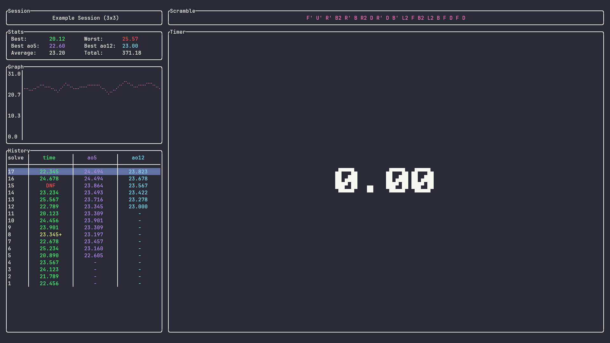

# lazytimer

A terminal-based speedcubing timer written in Rust.



## Features

- Timer with inspection mode
- Ghost mode for practicing without saving solves to your history
- Support for multiple puzzle types (2x2, 3x3, 4x4, 5x5, Skewb, Pyraminx)
- Solve statistics & graph
- Scramble generation
- Data persistence

## Installation

Make sure your terminal supports [progressive keyboard enhancements](https://sw.kovidgoyal.net/kitty/keyboard-protocol/) (also known as the Kitty keyboard protocol).

### Nix

If you use Nix, you can run `lazytimer` directly without installing it:

```bash
nix run github:xyzyx4546/lazytimer
```

#### Home Manager

To install and configure `lazytimer` using Home Manager, first add the flake to your inputs:

```nix
{
  inputs = {
    lazytimer = {
      url = "github:xyzyx4546/lazytimer";
      inputs.nixpkgs.follows = "nixpkgs";
    };
  };
}
```

Then add the module to your Home Manager configuration and enable the program:

```nix
{inputs, ...}: {
  imports = [
    inputs.lazytimer.homeModules.lazytimer
  ];

  programs.lazytimer = {
    enable = true;
    settings = {
      # Your config here
    };
  };
}
```

### Cargo

You can also install `lazytimer` using `cargo`:

```bash
cargo install lazytimer
```

## Configuration

The configuration file is located at `$XDG_CONFIG_HOME/lazytimer/config.toml` or `$HOME/.config/lazytimer/config.toml`.

You can customize the following options:

```toml
[general]
# Directory where solve data is stored
data_dir = "$XDG_DATA_HOME/lazytimer"
# Default puzzle type to show on startup (e.g., "ThreeByThree", "TwoByTwo", etc.)
default_puzzle = "ThreeByThree"

[timer]
# Inspection time in seconds (set to 0 to disable inspection)
inspection_time = 15
# Hide timer while solving
hide_timer_while_solving = false

[keybinds]
# Navigation
previous_puzzle = "h"
next_puzzle = "l"
previous_solve = "j"
next_solve = "k"
first_solve = "g"
last_solve = "Shift-g"
# Global actions
quit = "q"
show_keybinds = "?"
cancel = "Esc"
confirm = "Enter"
start_timer = "Space"
toggle_ghost_mode = "v"
# Solve actions
delete_solve = "d"
solve_details = "i"
toggle_plus_two = "+"
toggle_dnf = "-"
```
